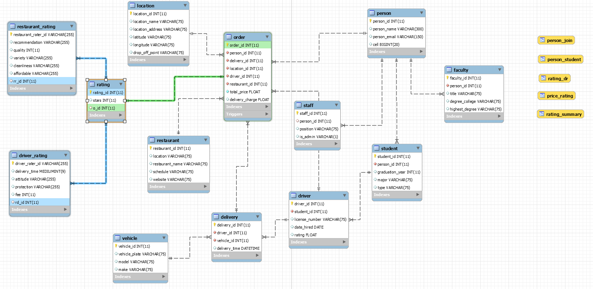

# Campus Eats

## Background

Campus eats is a database based on a food delivery service for students living on campus. This database holds the information on everything from orders to drivers and everything in between. In this project, we expanded the database to include rating tables for overall rating, driver rating, and restaurant rating. As well as create functions, stored procedures, views, and triggers to help further our evaluation and gain insight into the services provided by campus eats. 

    

 

